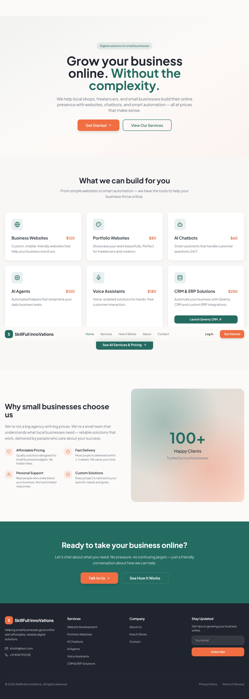
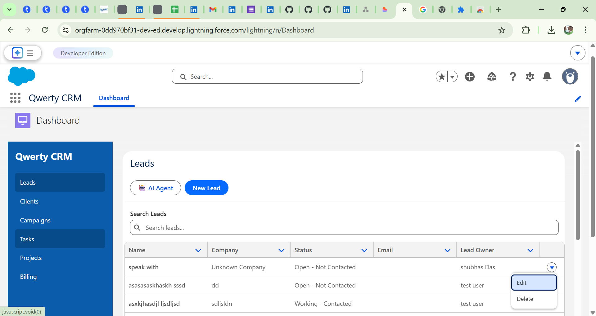

# Digital Growth AI – AI Enabled CRM Automation Platform

Digital Growth AI is an experimental CRM automation platform that demonstrates how modern customer engagement systems can integrate **CRM workflows, AI chatbots, and service websites** into a unified architecture.

The project simulates how organizations can automate **lead management, customer service interactions, and engagement workflows** using AI assisted automation layered on top of CRM concepts similar to **Salesforce Sales Cloud and Service Cloud**.

This repository showcases practical experimentation with **CRM architecture, AI-driven customer interaction, and API-based system design**.

---

# Business Problem

Modern businesses often struggle with managing customer interactions across multiple channels such as websites, service requests, and support queries.

Typical challenges include:

• Leads generated on websites are not properly captured into CRM systems
• Customer support queries require manual triaging
• Businesses lack automated systems for customer engagement
• Customer data and interaction history are fragmented across systems

A CRM-driven automation platform can help centralize these processes and automate engagement.

---

# Solution Overview

Digital Growth AI demonstrates a **CRM-centered architecture enhanced with AI automation**.

The platform enables:

• automated lead capture from website interactions
• chatbot-driven customer engagement
• support case creation and tracking
• AI-assisted customer query responses
• API-based service integration

The system architecture mirrors enterprise CRM implementations where **customer engagement systems integrate with CRM platforms like Salesforce**.

---

# Salesforce CRM Capabilities

This project models several CRM concepts that are commonly implemented within Salesforce environments.

### CRM Data Model

The following CRM objects are simulated within the platform:

• **Lead** – captures new inquiries generated from the service website
• **Contact** – maintains customer identity and profile data
• **Account** – represents companies or organizations associated with contacts
• **Case** – tracks customer support requests and service interactions

### CRM Workflow Concepts

• Lead capture through website interaction
• lead qualification and follow-up process
• case creation for customer support issues
• tracking customer interaction history

### Salesforce Integration Possibilities

Although the current implementation uses a simplified CRM structure, the architecture is designed to support integration with Salesforce via:

• Salesforce REST APIs
• webhook based integration
• data synchronization with CRM records
• automation using Salesforce Flow or Apex triggers

---

# AI Agent & Chatbot Automation

The system includes an experimental **AI chatbot layer** designed to automate initial customer interaction.

The chatbot acts as the first touchpoint for visitors interacting with the service website.

Capabilities include:

• answering service or product related questions
• guiding users through available services
• capturing lead information from conversations
• assisting users with support queries

The chatbot helps reduce manual interaction by acting as an **automated engagement layer before CRM processing**.

---

# Key Features

• AI driven chatbot for customer engagement
• website based lead capture
• CRM style lead and contact management
• support case tracking system
• API driven backend architecture
• modular system design for future CRM integrations

---

# Technology Stack

### Frontend

• TypeScript
• Vite
• Tailwind CSS

### Backend

• Node.js
• REST API architecture

### Data Layer

• Supabase database

### CRM Layer

• CRM data model inspired by Salesforce
• Lead / Contact / Case lifecycle concepts

### AI Layer

• chatbot interaction and automated response logic

---

# System Architecture


The platform follows a layered architecture that separates the presentation layer, interaction layer, business logic, and data services.

### Client Layer

The service website provides the user interface where visitors interact with the platform and initiate chatbot conversations.

### AI Interaction Layer

The AI chatbot handles user queries, gathers lead information, and assists with support requests.

### API Layer

A Node.js backend processes application logic, handles chatbot requests, and manages communication between services.

### CRM Layer

The CRM layer manages structured data representing leads, contacts, accounts, and support cases similar to Salesforce CRM systems.

### Data Layer

Supabase is used to store application data and maintain interaction records.

---

# Chatbot Interaction Flow


The chatbot manages the first stage of customer interaction.

Interaction flow:

User → Website Chat Interface → AI Chatbot → Intent Detection →
Lead Capture or Support Request → CRM Record Creation → Database Storage

This flow demonstrates how AI assisted engagement can integrate with CRM processes.

---

# Application Preview

### Service Website



### AI Chatbot Interaction


### CRM Data Management



---

# Project Structure

```
Digital_Growth_AI

docs/
 ├ architecture.png
 ├ chatbot-flow.png
 └ screenshots/

src/
 ├ components
 ├ services
 ├ api
 └ chatbot

supabase/
server.js
README.md
```

---

# Potential Salesforce Integration Enhancements

Future improvements can extend this system into a full Salesforce integrated architecture.

Possible enhancements include:

• Salesforce REST API integration
• automated Lead creation from chatbot interaction
• case creation from support conversations
• Salesforce Flow based automation
• Einstein AI driven insights

---

# Learning Objectives

This project explores how CRM systems can evolve with AI-driven engagement and API based architecture.

Key learning areas include:

• CRM data modeling
• AI assisted customer interaction
• API-driven system integration
• chatbot automation
• scalable architecture for CRM platforms

---

# Future Enhancements

• Full Salesforce CRM API integration
• Einstein AI powered customer insights
• advanced chatbot intent detection
• automated lead scoring
• CRM workflow automation using Flow

---

# Author

Shubha Das
Salesforce Developer

This project represents experimentation with CRM architecture, AI automation, and modern web technologies to simulate enterprise-grade customer engagement systems.

---
